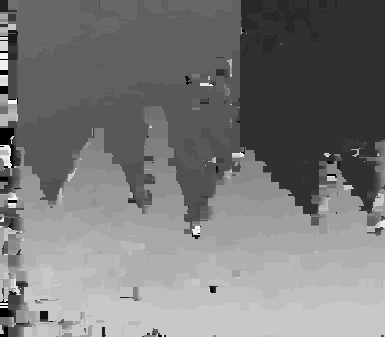
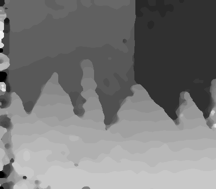

This project aims at parallelizing the disparity map creation for stereo images. 
We implement the block matching algorithm on the CPU and GPU. The CPU implementation
is in Python. The GPU implementation is in PyCUDA. 

You must run the main.py file in order to compute the disparity map. It contains
function calls for both the GPU code and the CPU code. Feel free to comment/un-
comment any of them. You can read the input at the beginning of this file, and
can add your custom path over there. The output files are written in the data folder.

The GPU code runs 4500 times faster than the CPU code, and achieves a frame rate of 
35 fps. 

Organization:
The host_code.py file contains the GPU kernel code, as well as the host code to
for interfacing with the device. 
The Disparity.py file contains the serial code function for computing the disparity 
between a stereo pair. 
The Error.py file can be used to find the error between the computed disparity and
the actual ground truth file. 

The output of our GPU code is:
 

And it's filtered version is given by:
 

